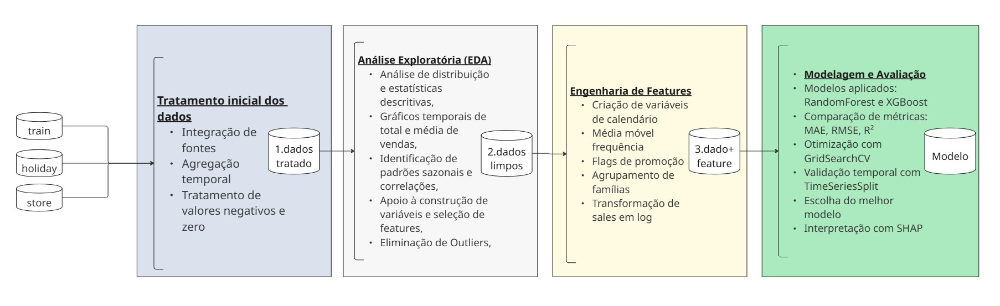

## Tratamento inicial dos dados 

Antes da análise exploratória e modelagem, foi realizada a **preparação da base de dados** com foco em consolidar as informações em *nível mensal por loja e família de produto*. As principais etapas incluíram:

- Integração de fontes: As bases de vendas, feriados e localização das lojas foram cruzadas para calcular a quantidade de feriados por mês, considerando a cidade e o tipo de feriado (nacional, regional ou local) aplicável a cada unidade.

- Agregação temporal: A base original, composta por registros diários, foi transformada em uma base mensal. Nessa etapa foram criadas variáveis como:
    - dias_ativos_venda: número de dias no mês em que houve vendas para determinada loja e família, refletindo a frequência de movimentação comercial.
    - qtd_feriados: contagem de feriados no mês que impactam cada loja, com base na sua localização e no tipo de feriado.

- Tratamento de valores inconsistentes:
    - Valores negativos foram removidos por representarem registros inválidos que poderiam comprometer a integridade da série.
    - Zeros e valores ausentes foram substituídos por 0.1 para evitar erros técnicos em transformações matemáticas (ex.: log()), garantir a presença de todas as combinações loja-produto ao longo do tempo e manter a continuidade das séries temporais — essencial para análises sazonais e uso de janelas móveis.

