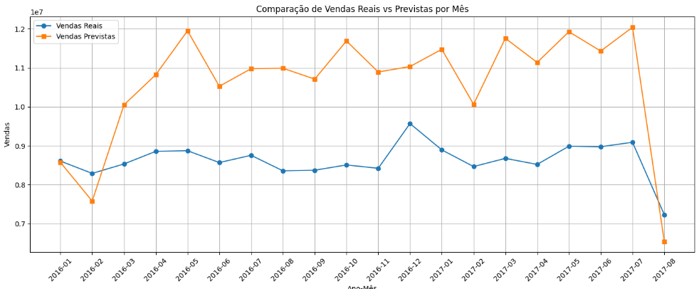

quando rodei o modelo sem considerar nenhuma feature nova, apenas com as colunas originais da base colunas_numericas = ['onpromotion', ]; colunas_categoricas = ['store_nbr', 'family_top6,'ano', 'mes']. Tive esse resultado:

        Modelo          MAE         RMSE        R2
0  RandomForest  2475.261475  4541.066640  0.786447
1       XGBoost  2404.394661  4417.450732  0.797915

Quando adicionei as features de 'qtd_feriados', 'dias_ativos_venda' que foram metricas criadas a partir das outras bases chegamos no resultado:

         Modelo          MAE         RMSE        R2
0  RandomForest  2466.802084  4383.265351  0.801031
1       XGBoost  2452.731941  4400.296292  0.799482

mesmo com bom resultado ao analizar mês a mês observamos bastante divergencias

adicionei uma feature de  'has_promo' -> se tem ou não promoção,'is_fim_ano' -> se é últimos meses do ano,'sazonal_forte'-> de acordo com os meses que estavam com mais erros, e não obtive melhora no modelo:

         Modelo          MAE         RMSE        R2
0  RandomForest  2527.470973  4604.633632  0.783767
1       XGBoost  2583.362303  4636.858152  0.780730

voltando na analise descritiva vi que o campo de 'sales', tem uma grande variação da média e mediana, e valores maximos absudos de alto. E dias_ativos_vend Vendas feitas em poucos dias do mês em muitos casos → se o modelo não considera isso direito, pode superestimar.Sabemndo disso criei a feature 'dias_ativos_venda_lag3' -> média móvel dos 3 meses, e coloquei sales em logaritimo para as váriasções não impactarem tanto. O resultado foi melhor:

         Modelo          MAE         RMSE        R2
0  RandomForest  2292.949935  4632.074253  0.894830
1       XGBoost  2132.752709  4100.291120  0.897266

